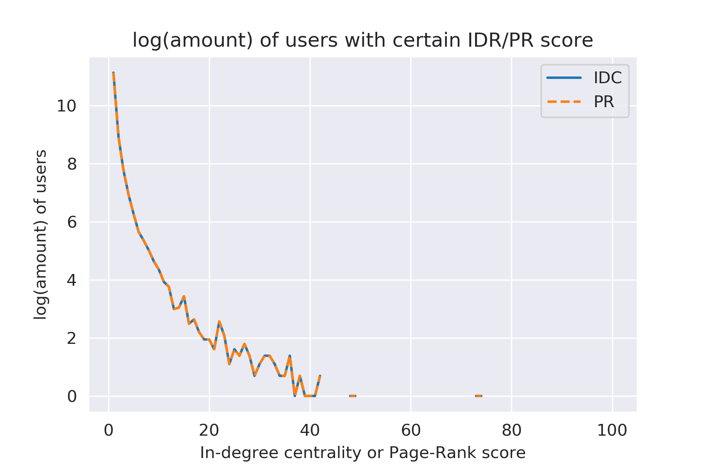
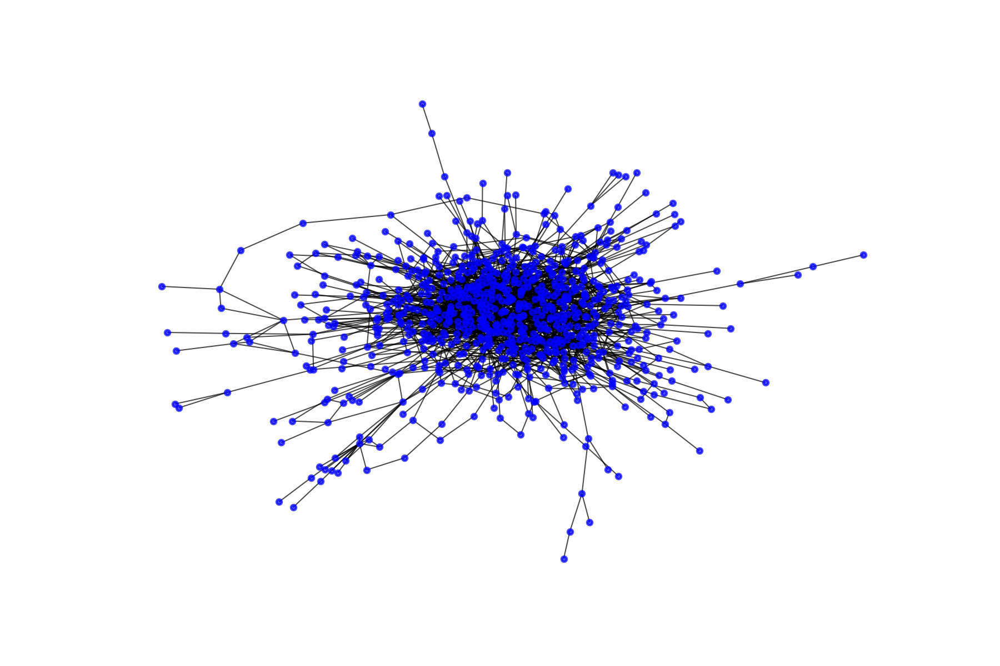
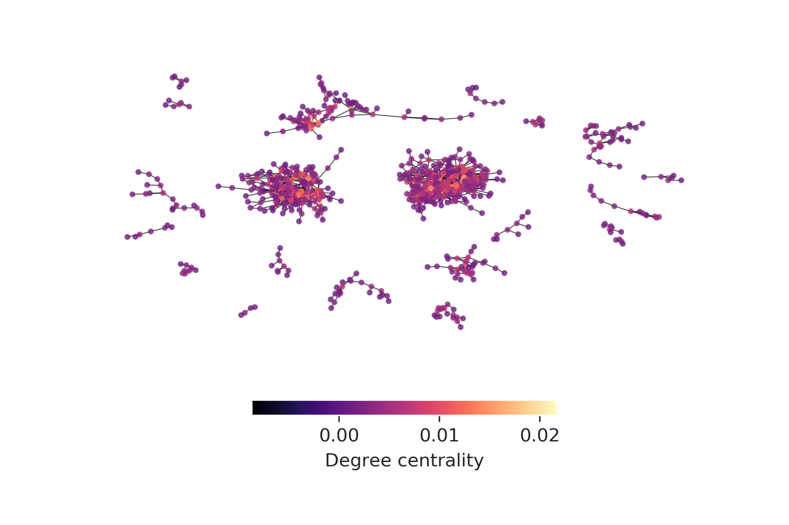
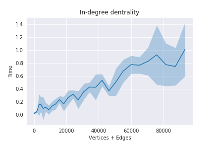
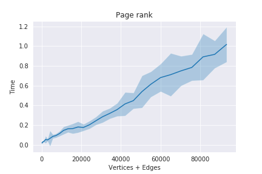
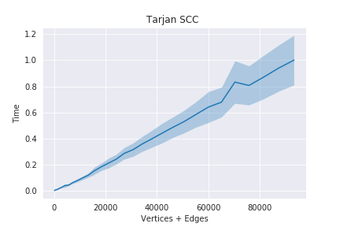
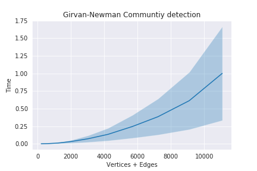
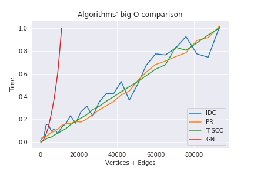

# Social Network Analysis - Communities and User Importance

## Introduction
In this project, I was interested in learning about structures within social networks. Among the users of a network, can we identify communities? Can we find out which users have a special role or are especially important within these communities? Follow along and we will try to assess how important users are in a network of over 80000 Twitter users, based on their [in-degree centrality](https://en.wikipedia.org/wiki/Centrality#Degree_centrality) and [Page-Rank](https://en.wikipedia.org/wiki/PageRank) score. In the second part, we will try to identify communities within the Facebook data of 783 UC San Diego students, using the [Girvan-Newmann algorithm](https://en.wikipedia.org/wiki/Girvan%E2%80%93Newman_algorithm).

Of cource I'm not the first person asking these questions and there great libraries already out there, but since I worked on this project as part of an open-ended capstone of the MOOC specialization *Object Oriented Java Programming: Data Structures and Beyond* on [Coursera.org](https://www.coursera.org/specializations/java-object-oriented), I coded up the algorithms from scratch in Java and used [NetworkX](https://networkx.github.io/) in Python to test my code.

## Table of contents
* [Introduction](#introduction)
* [Analysis](#analysis)
* [Class overview](#class-overview)
* [Testing](#testing)
* [Acknowledgement](#acknowledgement)

## Analysis
You can also read this part with the actual code I used in this [Jupyter Notebook](NetworkAnalysis.ipynb).
### Important users on Twitter
Twitter is an interesting network to study because it can be represented by a directed graph. Not all users who follow someone are being followed back. Some important or influential people may have a lot more followers, meaning a lot more incoming edges. 

That's something that can be easily quantified, e.g. by a user's in-degree centrality (how many followers?). But maybe one wants to consider certain users as more important if they are followed by other important users. That's the idea of Google's famous Page-Rank algorithm which considers how much of its own score each user contributes to the score of another user. Both these scores are computed by the Java code in this project.

The anonymous Twitter data we have here is is a social circle data set from the SNAP database and can be found [here](https://snap.stanford.edu/data/ego-Twitter.html). The graph contains 81306 vertices and 1768149 edges.

After claculating both metrics (stored in this [file](data/Analysis/twitterIDCPR.txt)) and scaling them on the same scale (between 0 and 100), we can observe that almost all users have a very low in-degree centrality and Page-Rank score and only very few users have very high scores. That agrees with the intuition that most users are just "normal people" who use the network to connect with their friends and only very few users can be considered as influential or important individuals. We can also see that the differences between in-degree centrality and Page-Rank score are very small. Since most users have very low scores, contributions from "important" users to other "important" user which make them even more important (the basic idea of the Page-Rank algorithm), seem to be practically irrelevant here. Both these observations, low scores for most users, and almost no difference between these score metrics, become clearer when they are plotted (on a log scale): 
We have seen that on this Twitter data, it is easy to identify the few important users in this network by either in-degree centrality or Page-Rank.

### Communities on Facebook
Presumably, users are parts of many kinds of social communities on Facebook, e.g. you may be connected to many of your current and former coworkers and you may be the only connection between these groups. This follows the idea that there are many connections within communities and fewer among communities. Hence, the edges between communities are passed by many shortest paths between users which means the [betweenness centrality](https://link.springer.com/referenceworkentry/10.1007%2F978-1-4419-9863-7_874) of these edges is high. 

The [Girvan-Newmann algorithm](https://en.wikipedia.org/wiki/Girvan%E2%80%93Newman_algorithm) tries to separate a network into communities by cutting these edges with high betweenness centrality. It calculates edge betweenness centrality for every edge and then removes the one with the highest score. This procedure is repeated until the desired number of communities is identified, or all the way down until all edges are removed and only single users/vertices remain.

The anonymous Facebook data we have here is is a "snapshot" of the network of students from the University of California in San Diego (UCSD) in 2005. The data was kindly provided by the hosts of the MOOC specialization *Object Oriented Java Programming: Data Structures and Beyond* on [Coursera.org](https://www.coursera.org/specializations/java-object-oriented). The graph contains 783 vertices and 1892 edges and is only a small fraction of the original data (due to limitations in computational power).

Let's visualize the original network. We can see that most people seem to have many connections with many other people but there are also some users on the outskirts of this network who are connected to only a few other users. 

Now let's look at the network after running the Girvan-Newmann algorithm and identifying 30 communities (by removing 451 edges). We can also calculate the degree centrality for each user/vertex and use it for color-mapping.

We can see that the Girvan-Newmann algorithm identified two very large communities and a couple of smaller communities. Within the larger communities, there are several users that have a high degree centrality, suggesting that they are more important or  influential within these communities. Since the data we use here is anonymized, we can only speculate about the nature of these communities. Maybe they represent student unions, study and sport clubs, or people in different degree programs. 

In a real example, we could now look into what it is that the users in these communities have in common. When working with real social network data, community detection algorithms and user-importance metrics can help us to look for patterns, connections, and trends in these networks with millions of users.

## Class overview

Here is a short overview of the Java classes and their purpose in this project. The sourc code can be found in the [src/](src/) directory.

**Class Graph.java**
This class is the main data structure which stores the information about edges in adjacency lists (here implemented as Hash Map with the source vertex of an edge as key and its target vertices as values in a Hash Set) both for directed and undirected (edges both ways) versions of the graph. It also contains getter methods to export these edge information and methods for performing the analysis of this project by either calculating it themselves (as for in-degree centrality) or by calling methods from other classes (as for Page Rank, strongly connected components, and communities).

**Class GraphLoader.java**
This class has a utility method for loading graphs form edge lists in text files. It was provided by the UCSD MOOC development team and has not been modified.

**Class PageRank.java**
This class is an implementation of the Page Rank algorithm.

**Class TarjanSCC.java**
This class is an implementation of the Tarjan algorithm to find strongly connected components (SCC) in a graph. Being able to find SCCs is required because it will be used to find the connected components, representing communities, that are created after the Girvan-Newmann algorithm has removed edges.

**Class GirvanNewmann.java**
This class is an implementation of the Girvan-Newmann algorithm to find communities in a graph by removing edges with high betweenness centrality. It finds all shortest paths between all vertices in the graph by performing breath-first-searches (BFS) for all vertex combinations. It then checks how many of these shortest paths go through each edge. If there is more than one shortest path between a pair of vertices, only the appropriate fraction is added to the betweenness centrality of the edge. The edges are also queued up in a priority queue, sorted by their betweenness centrality, so that more than one edge can be removed to speed up the excecution of the algorithm. This can, however, lead to inaccuracies if too many edges are removed at once.

**Class GraphTest.java**
This class is for testing of both correctness and perfomrance. A test method is implemented for each part of the analysis in the other classes. 

**Class GraphAnalyzer.java**
This classes’ main method contains the actual analysis performed in this project. It loads the data, calls all analysis methods on it, and exports the results to files.

## Testing
All tests were implemented in the [GraphTest.java](src/GraphTest.java) class.
### Correctness
To verify the correctness of the analysis (degree centrality, PageRank, strongly connected components, community detection), I created a variety of randomly generated example graphs with known properties with the Python [NetworkX](https://networkx.github.io/) package; a library for network analysis which allows to generate graphs and calculate their properties. The test examples can be found in the [data/TestGraphs/](data/TestGraphs/) directory, along with the [python code](data/TestGraphs/TestGraphMaker.ipynb) that created them. All tests were passed.
### Performance
You can also read this part with the actual code I used in this [Jupyter Notebook](PerformanceAnalysis.ipynb).

The test examples can be found in the [data/TestPerformance/](data/TestPerformance/) directory, along with the [python code](data/TestGraphs/TestPerformanceMaker.ipynb) that created them. 

Tests were performed on graphs ranging from 100 to 3000 vertices in steps of 100 (number of edges increases quadratically) and the execution time was recorded. Each case was tested 50 times to get better statistics. The Girvan-Newmann algorithm for community detection, however, was only tested for one iteration on the 100 to 1000 vertices graphs and only 3 times due to its much higher complexity.

#### In-degree centrality
This quantity is easy to calculate if edges are stored as adjacency lists. We just iterate through all vertices' adjacency lists and count +1 for every time a vertex has an incoming edge, then divide every value by V-1, where V is the number of vertices. Hence, the algorithm should run in O(E), where E is the number of edges. 

#### Page Rank
The algorithm calculates how much "contribution" of PageRank each vertex gets over any incoming edge it has from another vertex so the complexity is O(E+V). 

#### Tarjan algorithm fro detecting strongly connected components
The algorithm is based on a recursive depth-first-search, basically going along all paths in a component until it finds no more edges to go along, which means it found a full component. It's complexity is O(E+V). 

#### Girvan-Newman algorithm for detecting communities
The algorithm removes edges with highest betweenness centrality to split apart communities. It first calculates the edge betweenness centrality for all edges, which means that it has to find all shortest paths from any vertex to any other vertex in the graph an see how many of these paths go through an edge. If there is more than one shortest path from one vertex to another, the paths have to be counted fractionally to an edges betweenness centrality. Finding shortest paths is done by a breath-first-search, complexity O(E+V), and it's done for every vertex combination, so finding all shortest paths should be of complexity O((E+V)$^{2}$). That is for one iteration (we are only looking at one iteration here), so it looks somewhat quadratic. For all possible iterations, meaning removing all eges it would look qubic, and for a realistic case where we want to find a certain number of communities, probably somewhere in between quadratic and cubic big O. 

Looking at all these algorithms in comparison, it becomes clear that the community detection is the bottle neck in this analysis: 

## Acknowledgement

I'd like to thank the instructors of this MOOC, Christine Alvarado, Mia Minnes, and Leo Porter, for putting together a really interesting specialization. I learned a lot and had quite some fun.
Also thanks to whoever read this till the very end :)
